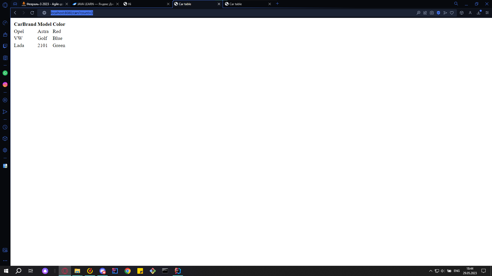

<h3 align="center">Задание:</h3>

<h3 >Создайте еще один контроллер, замаппленный на /cars.</h3>
/controller/CarController

<h3 >Создайте модель Car с тремя произвольными полями.</h3>
/model/Car

<h3 >Создайте список из 5 машин.</h3>
/service/CarServiceImp

<h3 >Создайте сервис с методом, который будет возвращать указанное число машин из созданного списка.</h3>
/service/CarServiceImp

<h3 >Создайте страницу cars.html. Реализуйте создание таблицы с машинами из сервиса с помощью thymeleaf.</h3>
/webapp/WEB-INF/pages/car.html
<h3 >При запросе /cars выводить весь список. При запросе /cars?count=2 должен отобразиться список из 2 машин, при /cars?count=3 - из 3, и тд. При count ≥ 5 выводить весь список машин.</h3>

<h3 align="center">Скриншоты</h3>

